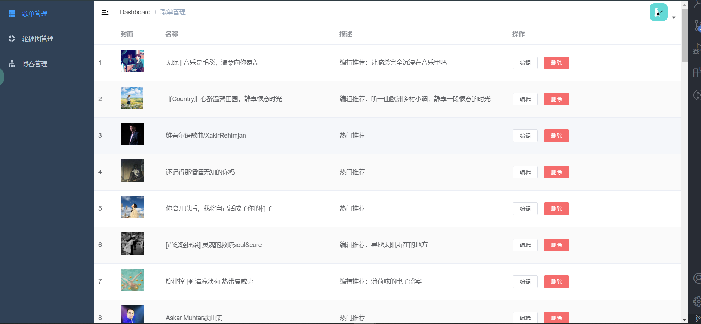
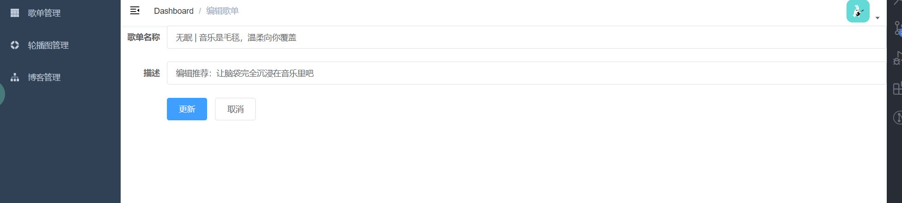
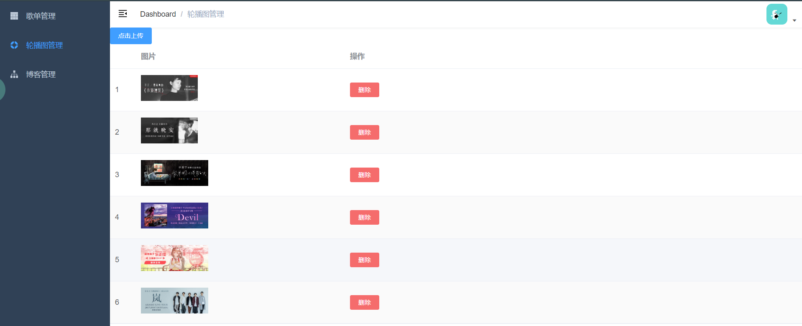
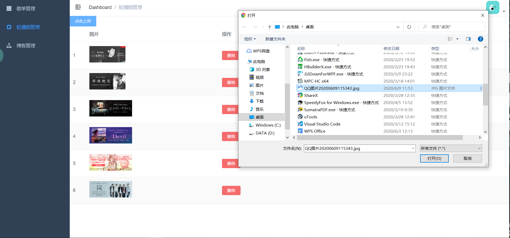
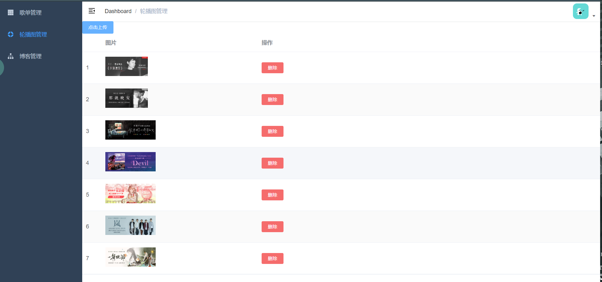

## 为微信云音乐端小程序而开发的管理系统页面

### 线上体验地址 - http://www.cloudmusic.hxin2020.top/

前端的页面使用了Vue-cli脚手架进行的项目搭建 页面UI使用Element-UI组件库

结合后端Node的Koa2写的的服务端实现了与小程序端的相互连接

### 展示页面

#### 登录界面

#### 管理系统首页展示效果 左侧导航栏  右侧操作页面

#### 歌单管理编辑操作页面

#### 轮播图管理页面 - 已成功实现图片的上传功能

**一次只能上传一张图片(可设置)，上传图片的大小自测1M以内的都可以成功上传，超过1M的图片会失败**

#### 上传图片演示

#### 其他功能请自己体验，与小程序端联动可以看到在随着管理系统的操作，小程序端也会产生对于的改变
